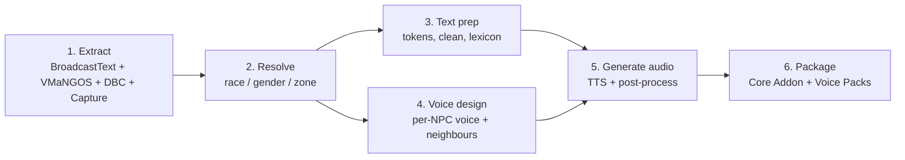
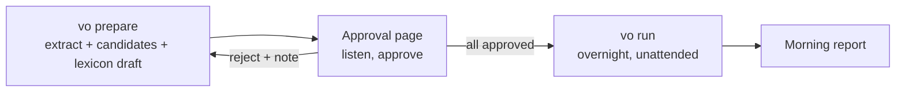

# VoiceForever — Build Spec

Sep 24, 2026 · @Stephen Henry

## Overview

Voice every quest and gossip line of **World of Warcraft: Forever** with local TTS, pre-generated offline and shipped as a free public addon. Forever is Blizzard's level-60 branch of WoW set in the original 2004 world, running on the retail engine and addon API (launch 4 Nov 2026). Every NPC gets its own consistent voice, and Neighbours never sound alike. Terms in **bold** are defined in `CONTEXT.md`.

**Key decisions**

- **Pre-generated only.** No runtime TTS. All audio is built offline and shipped as files. Fully automated apart from one **Approval Gate**: approving the race and gender **Archetypes** and the top Lexicon names. Everything after that runs unattended overnight.
- **Unique voice per NPC.** Every NPC gets an **NPC Voice** derived automatically from an approved Archetype. There is no per-NPC human step.
- **Core Content first.** v1 voices the original world from the **Source Data**. **Forever Content** (new quests, zones, the Skyborne race) is added incrementally from in-game **Capture**.
- **Storage is not a constraint.** Up to \~10 GB is acceptable, so encode for quality and generate shared lines per NPC.
- **Local generation** on an M5 Max (128 GB) with open models. No cloud TTS. The addon is free, so non-commercial model licences (e.g. F5-TTS) are acceptable.
- **Immersion rule.** Neighbours (nearby spawns or a shared quest chain) must sound clearly different, enforced offline via speaker-embedding distance.

**Scope**

| In | Out |
| --- | --- |
| Quest Text (detail, progress, completion) | Ambient Lines: say, yell, whisper, emote |
| Gossip, including the multi-quest greeting | Page Text: books, plaques, readable items |
| Quests from objects and items (Narrator) | Beast and grunt-only mobs, player characters |
| Forever Content, incrementally via Capture | Runtime or live TTS |

Estimated corpus: to be confirmed by the extraction count. It is smaller than the original \~110 h estimate now that Ambient Lines and Page Text are out.

**Release target:** on 4 Nov 2026, ship the Core Addon (with Capture) plus Voice Packs for levels 1–10, both factions. Further level bands follow as Voice Packs.

## Architecture

Six offline stages feed one addon. Every stage writes to a single SQLite database, so each stage can be re-run independently.



Stages 3 and 4 are independent and can run in parallel. Stage 5 is the long pole. It is resumable and keyed on `(line_id, text_hash, voice_id)`, so a voice or text change regenerates only the affected lines.

**Tooling:** Python for the pipeline, `mlx-audio` and PyTorch (MPS) for models, SQLite for state, and Lua for the addon.

## Automation and Approval Gate

The only human step is the Approval Gate. After approval, one command runs the whole pipeline unattended, and you get a report in the morning.



**1. `vo prepare`** runs extraction and text prep, then generates:

- **Candidates:** 8 per Archetype (32 today: 21 race and gender pairs plus 11 Creature Family variants, mapped in `vo.archetypes`), each a seeded VoxCPM2 voice design of the Archetype's anchor line. Each Candidate also speaks 3 of the Archetype's real lines as continuations of itself, so you can hear whether it holds up across lines.
- **The Narrator** as its own entry, fixed (Kokoro `bm_lewis`) and shown as already decided.
- **Lexicon drafts** for the top \~300 proper nouns by line count, each with a rendered sample.

**2. Approval page.** Per Candidate you can **Approve** (it becomes the Archetype's anchor) or **Reject**; per Archetype you can **Regenerate with a note** (e.g. "deeper, less theatrical"). The note is appended to the Archetype's description, and a new batch of Candidates is rendered. The actions are queued, and the next `vo prepare` applies them. You need an approved anchor for every Archetype. Per Lexicon entry you can accept or correct the spelling. Approval writes a locked `approved_voices.json` and `lexicon.json`, and `vo run` refuses to start without them. Names outside the top 300 are drafted automatically and checked by ASR.

**3. `vo run`** is fully unattended:

- It is a job queue in SQLite, checkpointed per line, so a crash or reboot resumes where it stopped.
- A failed line (ASR check, model error) is retried up to 3 times with a new seed, then quarantined. Failures never block the run.
- It keeps the Mac awake with `caffeinate -dis` for the duration.
- `--until 07:00` pauses at a set time; the next `vo run` resumes.
- Optional push notification on finish or fatal error (e.g. ntfy).

**4. Morning report.** A static HTML summary showing:

- lines done and remaining, coverage per zone and Voice Pack, and ETA;
- quarantined lines with their reasons;
- remaining Neighbour-separation violations;
- Drift and new Capture lines ingested since the last run;
- a few random sample clips per zone, for optional spot-checking.

Nothing in the report requires action. Quarantined lines are retried automatically on the next run.

## Dashboard

A local web dashboard is the single place to approve Archetypes and the Lexicon, watch the run, track coverage, and spot-check audio. It reads the pipeline's SQLite live, and the morning report is simply its overview page. All seven pages are built before the Northshire slice.

**Stack.** `vo dashboard` serves a Bun app on localhost using `bun:sqlite`, with no other dependencies. SQLite runs in WAL mode, so the dashboard reads while `vo run` writes. Pages refresh every 5 s via server-sent events. It can optionally be exposed over Tailscale to check from a phone.

**Pages**

| Page | Shows | Actions |
| --- | --- | --- |
| Overview | Run state (running, paused, until), overall progress, current stage, throughput (lines/min, audio hours per hour), ETA, per-worker status, recent errors, run history | Pause, resume, set `--until` |
| Approval | Every race and gender with its Candidates and test lines; the Narrator; the top Lexicon entries with samples | Approve, reject, regenerate with note; accept or correct spelling |
| Coverage | Per-zone and per-Voice-Pack table: total, done, failed and quarantined lines, plus % complete; drill down to zone, then NPC | — |
| NPC browser | Search by name, zone, race or role. Each NPC shows race, gender, Archetype, reference clip, and every line with player, status and ASR score | Flag voice, regenerate voice, regenerate line |
| Spot-check | Random line player, weighted toward newly generated lines, named NPCs, and low ASR scores; keyboard-driven (space plays, J/K rates, N next) | Thumbs up/down, flag |
| Separation | Closest same-race Neighbour pairs, with both clips side by side | Re-roll either voice |
| Quarantine | Failed lines with reason and retry count | Retry, edit TTS text, skip |

**How actions work.** The dashboard never edits audio directly. Every action writes a row to a `review_actions` table, and the next `vo run` consumes that queue first. This keeps the run the only writer of audio, so the dashboard is safe to use mid-run.

**Spot-check tracking.** Ratings are stored per line and per voice. A voice with repeated thumbs-down is auto-queued for a re-roll. The overview shows how many lines have been spot-checked per zone, so you can see where you haven't listened yet.

## Data extraction

All Source Data is public. The work is joining it, not collecting it.

**Sources**

| Need | Source |
| --- | --- |
| Gossip text | VMaNGOS `broadcast_text` (male_text / female_text). Blizzard's client `BroadcastText` DB2 is server-side only and not usable |
| Gossip menus per NPC | VMaNGOS `gossip_menu` → `npc_text` → `broadcast_text` |
| Quest text | VMaNGOS `quest_template` (Details, Objectives, RequestItemsText, OfferRewardText) |
| Quest greeting (multi-quest NPCs) | VMaNGOS `quest_greeting` |
| NPCs: name, subname, faction, flags, display IDs | VMaNGOS `creature_template`; CMaNGOS classic-db as a cross-check |
| Spawn positions | VMaNGOS `creature` table (map, x, y, z) |
| Zone IDs, quest start and end NPCs and objects | QuestieDB `data/Forever` npc/quest/object Lua tables (Forever zone maps) |
| Race and gender | Forever build `CreatureDisplayInfo` → `CreatureDisplayInfoExtra`, plus `CreatureModelData` file IDs mapped to paths via the community listfile (wago.tools DB2 CSV exports) |
| Forever Content, Drift | Capture records from the Core Addon's SavedVariables |

**Race and gender resolution**

1. For humanoid NPCs with a character model, `CreatureDisplayInfoExtra` gives race and sex directly.
2. For creature models, parse the `CreatureModelData` path (e.g. `Creature\Ogre\Ogre.mdx`) for race. Gender defaults to the model's; if ambiguous, flag it for review.
3. For NPCs with several display IDs, voice the most common model. Flag any whose display IDs mix races or genders.
4. For Capture-only NPCs, use the captured `UnitSex` and creature type, and flag them. (The client's `Creature` DB2 is server-side and incomplete.)
5. A `manual_overrides` table wins over everything else, covering disguised NPCs, speaking beasts and story characters.

**SQLite schema (core)**

```sql
CREATE TABLE npcs (
  id INTEGER PRIMARY KEY,      -- creature entry
  name TEXT, subname TEXT,
  race TEXT, gender TEXT,      -- resolved
  model TEXT, faction INTEGER,
  role TEXT,                   -- vendor, trainer, quest, guard, story...
  level_min INTEGER, level_max INTEGER,
  is_named INTEGER DEFAULT 0,
  source TEXT                  -- core | capture
);
CREATE TABLE spawns (npc_id INTEGER, map INTEGER, zone INTEGER, x REAL, y REAL, z REAL);
CREATE TABLE lines (
  id INTEGER PRIMARY KEY,
  npc_id INTEGER,              -- NULL for Narrator (object and item quest givers)
  type TEXT,                   -- quest_detail, quest_progress, quest_complete, quest_greeting, gossip
  quest_id INTEGER,            -- quest lines only
  player_gender TEXT,          -- m | f | NULL when the text has no $G
  raw_text TEXT,               -- as in Source Data, tokens intact
  tts_text TEXT,               -- cleaned, tokens neutralised, lexicon applied
  match_pattern TEXT,          -- gossip only: Lua pattern with tokens as wildcards
  text_hash TEXT,              -- Drift hash of the normalised, token-masked text
  source TEXT                  -- core | capture
);
CREATE TABLE voices (npc_id INTEGER PRIMARY KEY, voice_id TEXT, archetype TEXT, prompt TEXT, ref_clip TEXT, embedding BLOB);
CREATE TABLE audio (line_id INTEGER, voice_id TEXT, path TEXT, duration_s REAL, status TEXT);
CREATE TABLE capture (id INTEGER PRIMARY KEY, upload_id TEXT, npc_id INTEGER, npc_name TEXT, unit_sex INTEGER, creature_type TEXT,
  zone INTEGER, x REAL, y REAL, event TEXT, quest_id INTEGER, text TEXT, text_hash TEXT, locale TEXT, seen_at TEXT);
CREATE TABLE manual_overrides (npc_id INTEGER, field TEXT, value TEXT);
```

**Filter:** drop NPCs with no Quest Text or Gossip, and beast or grunt types, before voice design.

## Text processing

Player-specific tokens are neutralised in the spoken audio, so each line needs at most two variants (player gender).

**Token handling**

| Token | Meaning | Strategy |
| --- | --- | --- |
| `$G male:female;` | Player gender | Generate both variants |
| `$N` / `$n` | Player name | Neutral Address in audio ("friend", "adventurer") |
| `$R` / `$r` | Player race | Neutral Address in audio |
| `$C` / `$c` | Player class | Neutral Address in audio |
| `$B` | Line break | Convert to a pause |

The on-screen text keeps the real name, race and class; only the audio is neutral. This is future-proof against Forever's new race and any new race/class combinations.

**Cleaning for TTS**

- Strip colour codes and formatting (`|cff...|r`, `<...>`).
- Expand abbreviations and numbers ("10g" becomes "ten gold").
- Apply the Lexicon for lore names such as Thrall, Kel'Thuzad, Quel'Thalas and Ahn'Qiraj. This is the biggest single quality lever.
- Choose Neutral Address words that read naturally in context (e.g. "Greetings, $c" → "Greetings, friend").

**Dedupe.** Identical `(npc_id, tts_text)` pairs are generated once. Lines are **not** deduped across NPCs, since each NPC has its own voice.

## Voice design

Every NPC with dialogue gets a unique NPC Voice, derived automatically from an approved Archetype for its race and gender. Each voice must stay close enough to its Archetype to sound like the approved race, and far enough from its Neighbours to sound distinct.

**Voice model.** All NPC audio comes from **VoxCPM2** (Apache-2.0, MLX). The bake-off (#10, four listening rounds) found that it is the only open model that gets fantasy accents and character right, but only when it designs a voice from a text description. Designing per line drifts: every line sounds like a different person. Cloning a reference with other models keeps the identity but loses the character. The fix is to pick an **anchor clip** by ear and generate every line as a VoxCPM2 **continuation** of that anchor. Continuation copies the anchor faithfully, so an anchor with character yields lines with character, consistently (ADR-0004).

**1. Archetypes.** Every race and gender in the data, plus each Creature Family, has a description (race style guide). `vo prepare` renders several VoxCPM2 voice-design candidates of an anchor line per Archetype, and you pick the one with the right character on the Approval page. A race that needs it (e.g. orc male; later perhaps Undead or the Great Beasts family) also gets an effect chain, applied once to each candidate anchor: the processed clip is the anchor, and every line is a plain continuation of it, so the character carries into every line and the voice stays one person (bake-off round 5: the chain applied per line lost the character). Orc male's candidates are seeded from the bake-off anchors (`vo prepare --import-bakeoff orc_m`) rather than freshly designed.

**2. NPC anchor.** `vo voices` gives each NPC its own anchor: the approved Archetype anchor, shifted by a small seeded DSP variation (pitch ±0.8–2 semitones, formant up to ±6%, pace up to ±6%; wider for named NPCs). Every line continues from the shifted anchor, so the Archetype's character is kept by construction (ADR-0005). The seed comes from the NPC ID, so rebuilds are deterministic.

Four candidates are made per NPC. Each must stay close to the Archetype anchor: speaker similarity at or above the ceiling, and pitch and HNR within a band around the anchor's. The one chosen is the closest to the Archetype anchor that still clears the Neighbour floor.

The alternative, VoxCPM2 designing each NPC's anchor from the Archetype description plus bounded variation (role, level band as age, seeded pitch, pace, rasp, breathiness, age and accent traits), stays available as `vo voices --strategy design`. It gives more distinct NPCs but lost the orc character in measurement (#13).

**3. Embedding.** Embed each anchor with a speaker-verification model (WavLM-SV) and store it in `voices.embedding`.

**4. Neighbours.** Two NPCs are Neighbours if either holds:

- their spawns are within N yards of each other (tune N; start \~150 yd), or
- they share a quest chain (`PrevQuestId`/`NextQuestId`/`NextQuestInChain`, or one starts a quest the other ends). Links are direct (a quest and the next one), not a whole chain.

On Core Content at 150 yd there are 21,201 pairs over 2,255 voiced NPCs. That is 18.8 Neighbours per NPC on average (median 14), 6.3 of them from the same Archetype, and 113 NPCs have none. Multi-spawn generics dominate the maximum (Winter Reveler has 743).

No edge weights: spawn proximity already covers hubs and city districts.

**5. Two-sided constraint.** Every NPC Voice must satisfy two checks. Its distance to its **Archetype** must stay below a ceiling, so it still sounds like the voice you approved. Its distance to each **Neighbour** must stay above a single floor, so it sounds distinct. Violations are resolved by re-rolling traits and regenerating the NPC anchor, up to a cap. Anything still failing is listed in the morning report and does not block the run. It is recorded in `voice_builds` (`vo voices --leftovers`, and the Separation page). An NPC with no candidate that sounds like its Archetype keeps the Archetype anchor. Both thresholds live in `vo.voices.Config`. The floor (0.95, cosine) is provisional until it is calibrated by ear on about 20 pairs from the Separation page.

**6. Named NPCs (automated).** Named and story NPCs (`is_named`) get a wider variation budget, plus prompt hints derived from name, subname and role (e.g. "King" adds regal and measured; "Warchief" adds commanding). They go through the same constraints, with no manual step. The name hints apply to the design strategy. A voice prompt can still be pinned through `manual_overrides` (field `voice_prompt`), which designs that NPC's anchor from the pinned text. Their clips are surfaced first in the morning report's samples.

**Narrator.** One fixed voice for quests that start or end at objects and items (wanted posters, quest-starting items). It is excluded from Neighbours.

## Audio generation

Lines are generated by VoxCPM2 as continuations of each NPC's anchor clip. The job runs locally, resumably, in parallel workers on the M5 Max.

**Model choice** (bake-off in milestone 2; speeds approximate)

| Model | Role | Licence | Rough speed |
| --- | --- | --- | --- |
| VoxCPM2 2B (MLX) | Candidate design and every NPC line (continuation from the anchor) | Apache-2.0 | \~1–1.7× realtime per worker |
| Kokoro 82M, voice `bm_lewis` | Narrator | Apache-2.0 | \~30× realtime |

Rejected in the bake-off: Chatterbox, F5-TTS, Orpheus, Fish S2, OmniVoice, Seed-VC and Qwen3-TTS (they either couldn't do fantasy character or couldn't keep it). IndexTTS-2, Maya1, Higgs v2, Parler and Spark didn't run usefully on MLX.

**Throughput.** VoxCPM2 runs at \~1–1.7× realtime per worker. Unified memory is not the limit; GPU contention is, so tune the worker count empirically.

**Per-line settings by type**

- **Quest completion:** warmer and more upbeat.
- **Quest progress ("Have you got them yet?"):** short and neutral.
- **Gossip and greeting:** conversational, the NPC Voice's default delivery.

These live in one table (`DELIVERY` in `pipeline/src/vo/tts.py`) passed to every backend render; each backend applies what it can. Kokoro can only change speed, so today completion is rendered slightly faster (1.06×) and everything else at 1.0×. The table also holds Chatterbox-style `exaggeration` and `cfg_weight` for later backends. A change to a type's settings requeues that type's lines.

**Post-processing**

1. Trim leading and trailing silence, leaving about 150 ms.
2. Loudness-normalise to −16 LUFS integrated, with a −1 dBTP ceiling.
3. Run automatic QA: compare Whisper ASR output against `tts_text` and regenerate if the word error rate exceeds a threshold. This catches skipped words, hallucinated audio and mispronounced lore names.
4. Encode as Ogg Vorbis, mono, 48 kHz, \~96–128 kbps. Settle the final bitrate by measuring total size against the 10 GB ceiling.

**Output layout:** `packs/<voicePack>/<npcId>/<lineId>.ogg` (Narrator lines under `narrator/`), with the path recorded in `audio`.

## Client addon

The **Core Addon** listens for quest and gossip interactions, looks up the matching line, and plays the pre-generated file from an installed **Voice Pack**. It targets Forever's retail addon API.

**Events and lookup**

| Event | Text from | Lookup key |
| --- | --- | --- |
| `QUEST_DETAIL` | `GetQuestText()` + `GetObjectiveText()` | `(GetQuestID(), "detail", player gender)` |
| `QUEST_PROGRESS` | `GetProgressText()` | `(GetQuestID(), "progress", player gender)` |
| `QUEST_COMPLETE` | `GetRewardText()` | `(GetQuestID(), "complete", player gender)` |
| `QUEST_GREETING` | `GetGreetingText()` | NPC ID + template match |
| `GOSSIP_SHOW` | `C_GossipInfo.GetText()` | NPC ID + template match |

- **NPC ID** is the 6th field of the `Creature-…` GUID from `UnitGUID("npc")`. Quests from objects and items resolve by quest ID and play the Narrator line.
- **Quest Text** never depends on wording, so there is no text-hash parity to maintain for lookup.
- **Gossip template matching.** Each NPC's entry in the index holds its gossip templates as Lua patterns, with tokens as wildcards. The displayed text is matched against that NPC's handful of patterns. English clients only; other locales skip Gossip.

**Drift.** Each Quest Text entry also carries a `text_hash` of its normalised, token-masked text (FNV-1a 32-bit in Lua and Python, with a shared test-vector file). The addon re-masks the player's name, race and class in the displayed text, hashes it, and on mismatch **still plays the audio** but records the line as Drift through Capture. A false Drift flag (e.g. a literal "Dwarf" in the text) is harmless, since Drift is only logged.

**Capture.** Always on, capped at \~5,000 records and de-duplicated by hash, stored in SavedVariables. Every lookup miss and every Drift is recorded with NPC ID, name, `UnitSex`, creature type, zone, map position, event, quest ID, locale and the raw displayed text. Players upload their SavedVariables file to a public upload page; the pipeline ingests it as a second source for Forever Content. A `/vf export` hint tells players where the file is.

**Playback**

- `PlaySoundFile(path, "Dialog")` returns a handle. Keep one active handle, and `StopSound(handle)` on a new line (even one without audio), when its own window closes (`QUEST_FINISHED`/QuestFrame hide, `GOSSIP_CLOSED`/GossipFrame hide), or on walking away: while a line plays, every 0.5 s check that the `npc` unit is unchanged and `CheckInteractDistance("npc", 3)` holds. The distance check is skipped in combat.
- Settings (`VoiceForeverDB.settings`, versioned and migrated, in the Settings panel and `/vf`): volume, per-type toggles (detail, progress, completion, greeting, gossip, Narrator), auto-play, a replay button on the quest and gossip frames, and English audio on non-English clients (on by default; Quest Text only). Volume is the game's Dialog volume CVar (`Sound_DialogVolume`), because `PlaySoundFile` has no per-sound volume. Toggles and auto-play only control automatic playback; the replay button always plays.

**Locales.** Quest Text audio plays in English on every locale, since lookup is by quest ID. Gossip is voiced on English clients only.

**Packaging and distribution**

- **Core Addon:** events, lookup index, Drift hashing, Capture, settings. No audio. Published on CurseForge and Wago.
- **Voice Packs:** one addon per faction (Alliance, Horde, Neutral) and level band (1–10, 10–20, …, 50–60), each holding the audio plus its slice of the lookup index. Assignment rules: ADR-0003. `vo package` builds every pack that has audio (or `--pack`) and reports lines per pack. Published on CurseForge and Wago alongside the Core Addon, so addon managers handle updates. Players install only the packs they need.
- The client only sees files that existed at launch. After installing or updating packs, restart the game; `/reload` isn't enough.

## Milestones and QA

The first playable slice is one starting zone end to end. It proves the whole pipeline before the full generation run. Launch day (4 Nov 2026) ships the 1–10 Voice Packs.

| # | Milestone | Done when |
| --- | --- | --- |
| 1 | Extraction | SQLite holds every NPC with race, gender, zone and role, plus all Quest Text and Gossip; real word and line counts are known; under 1% of NPCs are unresolved |
| 2 | Model bake-off | Chatterbox, F5 and Orpheus compared on \~50 lines across 5 races; default model and settings chosen |
| 3 | Orchestration and dashboard | `vo prepare` / `vo run` work end to end on a single zone; resume after a kill; retries and quarantine work; all seven dashboard pages work |
| 4 | Vertical slice: Northshire | Every Northshire line voiced by `vo run` with no manual steps; the Core Addon plays it in Forever with zero lookup misses; Capture records misses and Drift |
| 5 | Approval Gate | Every race and gender has at least one approved Archetype; top Lexicon names approved; `approved_voices.json` and `lexicon.json` locked |
| 6 | Launch: levels 1–10 | Core Addon and 1–10 Voice Packs for both factions published on CurseForge and Wago by 4 Nov 2026 |
| 7 | Remaining Core Content | `vo run` completes all level bands, passing ASR QA, published as Voice Packs |
| 8 | Capture loop | Upload page live; uploaded Capture ingested; Forever Content and Drift regenerated by a follow-up `vo run` |

**QA checks**

- **Coverage:** voiced lines ÷ extracted lines, per zone and per Voice Pack.
- **ASR word error rate** per line, with auto-regeneration above threshold.
- **Hash parity:** Lua and Python produce identical Drift hashes on the shared test vectors.
- **Gossip matching:** every gossip template matches its own rendered text for each player gender, name, race and class in a test harness.
- **Capture:** misses and Drift from playtesting and uploads feed back into the pipeline.
- **Voice separation:** a report of the closest same-race Neighbour pairs, plus a spot-check by ear in capitals.

## Open questions and risks

- [ ] **Voice-design model:** which model turns text prompts into reference clips reliably for fantasy races (ogre, troll, tauren)? Needs a spike before milestone 4.
- [ ] **Separation threshold:** what embedding distance actually sounds different to a player? Calibrate once on \~20 pairs on the Approval page, then fix it for all runs.
- [ ] **Neighbour radius:** start at \~150 yd and tune against a real 30-minute play route.
- [ ] **Capture upload trust:** how uploaded Capture is validated before it becomes audio. Deferred until Forever Content collection starts.

**Risks**

| Risk | Impact | Mitigation |
| --- | --- | --- |
| Forever rewords original Quest Text | Audio doesn't match on-screen text | Drift hash flags it through Capture; next `vo run` regenerates |
| Gossip template fails to match | Silent missing Gossip | Template test harness, plus Capture of misses |
| Race or gender misresolved from models | Wrong-sounding NPCs | Mixed-model flags, manual overrides, and a review of the top 500 NPCs by quest count |
| Lore-name mispronunciation | Breaks immersion | Lexicon (top names human-approved), plus ASR checks on name-heavy lines |
| TTS artefacts on long lines | Garbled audio | Sentence-level chunking with crossfades, plus ASR QA |
| Generated voices drift toward generic | Reduces the immersion goal | Race style guides, wider budget for named NPCs, and `manual_overrides` for voice prompts |
| Forever Content unknown to Source Data | Misses on new quests and zones | Capture from players, ingested incrementally |
