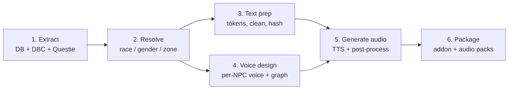
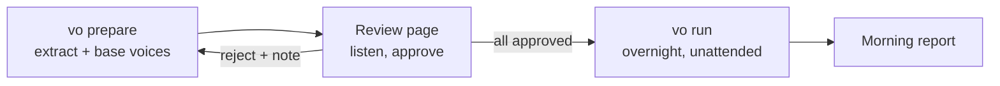

# VoiceForever — Build Spec

Sep 24, 2026 · @Stephen Henry

## Overview

Fully voice every line of WoW Classic (1.12) dialogue with local TTS, pre-generated offline and shipped as a client addon. Every NPC gets its own consistent voice, and NPCs a player meets close together never sound alike.

**Key decisions**

- **Pre-generated only.** No runtime TTS. All audio is built offline and shipped as files. Fully automated with one human gate: approving the race and gender base voices. Everything after that runs unattended overnight.
- **Unique voice per NPC.** Named story NPCs get hand-crafted voices; all others get generated ones.
- **Storage is not a constraint.** Up to \~10 GB is acceptable, so encode for quality and generate shared lines per NPC.
- **Local generation** on an M5 Max (128 GB) with open models. No cloud TTS.
- **Immersion rule.** NPCs likely to be met within \~30 minutes of each other must sound clearly different, enforced offline via a neighbour graph and speaker-embedding distance.

**Scope**

| In | Out |
| --- | --- |
| Quest text (greeting, detail, progress, completion) | Beast and grunt-only mobs (murlocs, animals) |
| NPC gossip | Player characters |
| Scripted say, yell, whisper and emote lines | Retail or later expansion content |
| Books, plaques and page text (narrator) | Runtime or live TTS |

Estimated corpus: roughly 0.6–1M words, about 110 hours of speech (approximate, to be confirmed by the extraction count).

## Architecture

Six offline stages feed one addon. Every stage writes to a single SQLite database, so each stage can be re-run independently.



Stages 3 and 4 are independent and can run in parallel. Stage 5 is the long pole. It is resumable and keyed on `(npc_id, text_hash, voice_id)`, so a voice or text change regenerates only the affected lines.

**Tooling:** Python for the pipeline, `mlx-audio` and PyTorch (MPS) for models, SQLite for state, and Lua for the addon.

## Automation and approval gate

The only human step is approving the base voices for each race and gender. After approval, one command runs the whole pipeline unattended, and you get a report in the morning.



**1. `vo prepare`** runs extraction and text prep, then generates the **base voice set**:

- For each race and gender, 3 candidate archetypes: roughly 20 races × 2 × 3 ≈ 120 voices.
- Each archetype renders the same 3 test lines: a greeting, a quest-detail passage, and a yell.
- The narrator voice is included as its own entry.

**2. Review page.** The dashboard's Approval page lists every race and gender, with audio players for each candidate. Per candidate you can **Approve**, **Reject**, or **Regenerate with a note** (e.g. "deeper, less theatrical"). The note is appended to that archetype's prompt. You need at least one approved archetype per race and gender. Approval writes a locked `approved_voices.json`, and `vo run` refuses to start without it.

**3. `vo run`** is fully unattended:

- It is a job queue in SQLite, checkpointed per line, so a crash or reboot resumes where it stopped.
- A failed line (ASR check, model error) is retried up to 3 times with a new seed, then quarantined. Failures never block the run.
- It keeps the Mac awake with `caffeinate -dis` for the duration.
- `--until 07:00` pauses at a set time; the next `vo run` resumes. The full run is about 1–2 days, so expect 1–2 nights.
- Optional push notification on finish or fatal error (e.g. ntfy).

**4. Morning report.** A static HTML summary showing:

- lines done and remaining, coverage per zone, and ETA;
- quarantined lines with their reasons;
- remaining voice-separation violations;
- a few random sample clips per zone, for optional spot-checking.

Nothing in the report requires action. Quarantined lines are retried automatically on the next run.

## Dashboard

A local web dashboard is the single place to approve base voices, watch the run, track coverage, and spot-check audio. It reads the pipeline's SQLite live, and the morning report is simply its overview page.

**Stack.** `vo dashboard` serves a Bun app on localhost using `bun:sqlite`, with no other dependencies. SQLite runs in WAL mode, so the dashboard reads while `vo run` writes. Pages refresh every 5 s via server-sent events. It can optionally be exposed over Tailscale to check from a phone.

**Pages**

| Page | Shows | Actions |
| --- | --- | --- |
| Overview | Run state (running, paused, until), overall progress, current stage, throughput (lines/min, audio hours per hour), ETA, per-worker status, recent errors, run history | Pause, resume, set `--until` |
| Approval | Every race and gender with candidate archetypes and their 3 test lines | Approve, reject, regenerate with note |
| Coverage | Per-zone table: total, done, failed and quarantined lines, plus % complete; drill down to zone, then NPC | — |
| NPC browser | Search by name, zone, race or role. Each NPC shows race, gender, archetype, reference clip, and every line with player, status and ASR score | Flag voice, regenerate voice, regenerate line |
| Spot-check | Random line player, weighted toward newly generated lines, named NPCs, and low ASR scores; keyboard-driven (space plays, J/K rates, N next) | Thumbs up/down, flag |
| Separation | Closest same-race voice pairs per hub, with both clips side by side | Re-roll either voice |
| Quarantine | Failed lines with reason and retry count | Retry, edit TTS text, skip |

**How actions work.** The dashboard never edits audio directly. Every action writes a row to a `review_actions` table, and the next `vo run` consumes that queue first. This keeps the run the only writer of audio, so the dashboard is safe to use mid-run.

**Spot-check tracking.** Ratings are stored per line and per voice. A voice with repeated thumbs-down is auto-queued for a re-roll. The overview shows how many lines have been spot-checked per zone, so you can see where you haven't listened yet.

## Data extraction

All source data is public. The work is joining it, not collecting it.

**Sources**

| Need | Source |
| --- | --- |
| NPCs: name, subname, faction, flags, display IDs | VMaNGOS DB (1.12-accurate) `creature_template`; CMaNGOS classic-db as a cross-check |
| Spawn positions | `creature` table (map, x, y, z) |
| Zone IDs, quest start and end NPCs | Questie npcData / questData Lua tables |
| Quest text | `quest_template` (Details, Objectives, RequestItemsText, OfferRewardText) |
| Gossip | `gossip_menu` → `npc_text` / `broadcast_text` |
| Scripted lines | `script_texts`, `dbscript_string`, `creature_text` (whichever the chosen DB uses) |
| Books and plaques | `page_text`, linked from items and game objects |
| Race and gender | `CreatureDisplayInfo` → `CreatureDisplayInfoExtra`, plus `CreatureModelData` model paths (wago.tools CSV exports for the Classic build) |

**Race and gender resolution**

1. For humanoid NPCs with a character model, `CreatureDisplayInfoExtra` gives race and sex directly.
2. For creature models, parse the `CreatureModelData` path (e.g. `Creature\Ogre\Ogre.mdx`) for race. Gender defaults to the model's; if ambiguous, take it from `$G`-free text context, or flag it for review.
3. For NPCs with several display IDs, voice the most common model. Flag any whose display IDs mix races or genders.
4. A `manual_overrides` table wins over everything else, covering disguised NPCs, speaking beasts and story characters.

**SQLite schema (core)**

```sql
CREATE TABLE npcs (
  id INTEGER PRIMARY KEY,      -- creature entry
  name TEXT, subname TEXT,
  race TEXT, gender TEXT,      -- resolved
  model TEXT, faction INTEGER,
  role TEXT,                   -- vendor, trainer, quest, guard, story...
  level_min INTEGER, level_max INTEGER,
  is_named INTEGER DEFAULT 0
);
CREATE TABLE spawns (npc_id INTEGER, map INTEGER, zone INTEGER, x REAL, y REAL, z REAL);
CREATE TABLE lines (
  id INTEGER PRIMARY KEY,
  npc_id INTEGER,              -- NULL for narrator (books)
  type TEXT,                   -- quest_detail, gossip, say, yell, whisper, book...
  source_id INTEGER,           -- quest id, text id, page id
  raw_text TEXT, tts_text TEXT,
  variant TEXT,                -- e.g. gender=f, race=dwarf, class=mage
  text_hash TEXT               -- hash of the client-visible text
);
CREATE TABLE voices (npc_id INTEGER PRIMARY KEY, voice_id TEXT, prompt TEXT, ref_clip TEXT, embedding BLOB);
CREATE TABLE audio (line_id INTEGER, voice_id TEXT, path TEXT, duration_s REAL, status TEXT);
CREATE TABLE manual_overrides (npc_id INTEGER, field TEXT, value TEXT);
```

**Filter:** drop NPCs with no dialogue lines, and beast or grunt types, before voice design.

## Text processing

Every substitution token is expanded into concrete variants at build time. The client then only ever needs to look up an exact, fully rendered string.

**Token handling**

| Token | Meaning | Strategy |
| --- | --- | --- |
| `$G male:female;` | Player gender | Generate both variants |
| `$R` / `$r` | Player race | Generate per playable race valid for the quest's faction (4 per faction) |
| `$C` / `$c` | Player class | Generate per valid class for that race |
| `$N` / `$n` | Player name | Can't be pre-generated. Default: rewrite to a neutral address ("friend", "adventurer"). Option: splice around the name gap |
| `$B` | Line break | Convert to a pause |

Combining `$R` and `$C` multiplies variants, but only on the minority of lines that use them.

**Lookup key.** The addon hashes the text as the client renders it. The pipeline must reproduce that exact render for every variant: the token-substituted string with `$N` left as the player's name. Hash the template with `$N` masked, and have the addon apply the same mask before hashing.

**Cleaning for TTS**

- Strip colour codes and formatting (`|cff...|r`, `<...>`).
- Expand abbreviations and numbers ("10g" becomes "ten gold").
- Add a pronunciation lexicon for lore names such as Thrall, Kel'Thuzad, Quel'Thalas and Ahn'Qiraj. This is the biggest single quality lever.
- Emote lines (`CHAT_MSG_MONSTER_EMOTE`) are narration about the NPC, so route them to the narrator voice or skip them.

**Dedupe.** Identical `(npc_id, tts_text)` pairs are generated once. Lines are **not** deduped across NPCs, since each NPC has its own voice.

## Voice design

Every NPC with dialogue gets a unique voice, derived automatically from an approved base voice for its race and gender. Each voice must stay close enough to its base to sound like the approved race, and far enough from its neighbours to sound distinct.

**1. Voice prompt per NPC.** Start from an approved base archetype for the NPC's race and gender, then add bounded variation. If a race and gender has several approved archetypes, pick one deterministically by NPC ID:

- **Base:** race, gender, role (guard, innkeeper, trainer, noble, bandit), faction, and level band as an age proxy.
- **Race style guide:** one auto-drafted paragraph per race, refined through notes on the review page (e.g. dwarf: deep, gravelly, broad northern accent; troll: Caribbean-inflected, drawn-out vowels).
- **Random traits:** pitch, pace, rasp, breathiness, age, and accent strength. The seed is the NPC ID, so rebuilds are deterministic.

**2. Reference clip.** Render a \~10–15 s neutral sentence with a voice-design model driven by the prompt. That clip is the NPC's voice identity for cloning in stage 5.

**3. Embedding.** Embed each reference clip with a speaker-verification model (ECAPA-TDNN or WavLM-SV) and store it in `voices.embedding`.

**4. Neighbour graph.** Nodes are NPCs. Weighted edges connect NPCs a player is likely to meet close together:

| Edge | Weight |
| --- | --- |
| Same quest chain (`PrevQuestId`/`NextQuestId`, start/end links) | Strong |
| Spawns within N yards (tune N; start \~150 yd) | Strong |
| Same quest hub or city district | Medium |
| Adjacent via flight path, or same zone | Weak |

**5. Two-sided constraint.** Every NPC voice must satisfy two checks. Its distance to its **base archetype** must stay below a ceiling, so it still sounds like the voice you approved. Its distance to each **neighbour** must stay above a floor scaled by edge weight, so it sounds distinct. Violations are resolved by re-rolling traits and regenerating the reference clip, up to a cap. Anything still failing is listed in the morning report and does not block the run.

**6. Named NPCs (automated).** Named and story NPCs (`is_named`) get a wider variation budget, plus prompt hints derived from name, subname and role (e.g. "King" adds regal and measured; "Warchief" adds commanding). They go through the same constraints, with no manual step. Their clips are surfaced first in the morning report's samples.

**Narrator.** One fixed voice for books, plaques and emotes. It is excluded from the graph.

## Audio generation

Lines are generated by a zero-shot cloning model conditioned on each NPC's reference clip. The job runs locally, resumably, in parallel workers on the M5 Max.

**Model choice** (bake-off in milestone 2; speeds approximate)

| Model | Role | Cloning | Rough speed |
| --- | --- | --- | --- |
| Chatterbox | Default for NPC lines: cloning plus emotion/exaggeration control | Yes | A few × realtime |
| F5-TTS (MLX port) | Alternative default, strong prosody | Yes | A few × realtime |
| Orpheus 3B | Expressive yells and story NPCs (laugh and sigh tags) | Via fine-tune | \~1–2× realtime |
| Kokoro 82M | Narrator voice (books, plaques) | No | Tens of × realtime |

**Throughput.** About 110 h of audio, plus per-NPC duplicates of shared gossip and token variants. At \~3× realtime per worker with 3–4 workers in parallel, that's roughly **1–2 days** of wall time. Unified memory is not the limit; GPU contention is, so tune the worker count empirically.

**Per-line settings by type**

- **Yell:** higher exaggeration, +3 dB offset.
- **Whisper:** low exaggeration, −6 dB offset.
- **Quest completion:** warmer and more upbeat.
- **Quest progress ("Have you got them yet?"):** short and neutral.

**Post-processing**

1. Trim leading and trailing silence, leaving about 150 ms.
2. Loudness-normalise to −16 LUFS integrated, then apply the per-type offset, with a −1 dBTP ceiling.
3. Run automatic QA: compare Whisper ASR output against `tts_text` and regenerate if the word error rate exceeds a threshold. This catches skipped words, hallucinated audio and mispronounced lore names.
4. Encode as Ogg Vorbis, mono, 48 kHz, \~96–128 kbps. Settle the final bitrate by measuring total size against the 10 GB ceiling.

**Output layout:** `audio/<zoneId>/<npcId>/<textHash>.ogg`, with the path recorded in `audio`.

## Client addon

A small core addon listens for dialogue events, derives `(npcId, textHash)`, and plays the matching pre-generated file. The audio lives in load-on-demand packs.

**Events**

| Event | Text from | NPC from |
| --- | --- | --- |
| `QUEST_GREETING` | `GetGreetingText()` | `UnitGUID("npc")` |
| `QUEST_DETAIL` | `GetQuestText()` + `GetObjectiveText()` | `UnitGUID("npc")` |
| `QUEST_PROGRESS` | `GetProgressText()` | `UnitGUID("npc")` |
| `QUEST_COMPLETE` | `GetRewardText()` | `UnitGUID("npc")` |
| `GOSSIP_SHOW` | `GetGossipText()` | `UnitGUID("npc")` |
| `CHAT_MSG_MONSTER_SAY` / `YELL` / `WHISPER` | Event arg 1 | Sender GUID in event args |
| `ITEM_TEXT_READY` | `ItemTextGetText()` per page | Narrator |

The creature entry ID is the 6th field of a `Creature-…` GUID. Quest items and game-object quest givers use the object ID, with the narrator voice as fallback.

**Playback**

- `PlaySoundFile(path, "Dialog")` returns a handle. Keep one active handle, and `StopSound(handle)` on a new line, `GOSSIP_CLOSED`, `QUEST_FINISHED`, or walking away.
- For monster say/yell, only play if the NPC is within range; skip overlapping chatter from the same NPC.
- Settings: volume through the Dialog channel, per-type toggles, auto-play on or off, and a replay button on the quest frame.

**Hashing.** Implement the same non-cryptographic hash (e.g. FNV-1a 32-bit) in pure Lua and in Python. Normalise identically on both sides: strip colour codes, collapse whitespace, and mask the player name. A shared test vector file guards this; it's the most likely source of silent misses.

**Packaging**

- **Core addon:** event handling, hashing, settings, and an index from `npcId` to pack.
- **Load-on-demand packs** per zone group (e.g. Elwynn/Westfall/Redridge). Each holds the audio plus a Lua lookup `[npcId][textHash] = file`. Only the current zone's pack is loaded, which keeps Lua memory small.
- The client only sees files that existed at launch. After installing or updating packs, restart the game; `/reload` isn't enough.

**Fallback.** On a lookup miss, log `(npcId, textHash, text)` to SavedVariables. Feed that file back into the pipeline to find missing or mis-hashed lines.

## Milestones and QA

The first playable slice is one starting zone end to end. It proves the whole pipeline before paying for the full 1–2 day generation run.

| # | Milestone | Done when |
| --- | --- | --- |
| 1 | Extraction | SQLite holds every NPC with race, gender, zone and role; real word and line counts are known; under 1% of NPCs are unresolved |
| 2 | Model bake-off | Chatterbox, F5 and Orpheus compared on \~50 lines across 5 races; default model and settings chosen |
| 3 | Orchestration | `vo prepare` / `vo run` work end to end on a single zone; resume after a kill; retries and quarantine work; dashboard shows live progress and plays audio |
| 4 | Vertical slice: Northshire | Every Northshire line voiced by `vo run` with no manual steps; addon plays it in-game with zero lookup misses |
| 5 | Base voice approval | Review page built; every race and gender has at least one approved archetype; `approved_voices.json` locked |
| 6 | Overnight full run | `vo run` completes all lines over 1–2 nights, passing ASR QA, packaged into packs |
| 7 | Playtest | Starting zones played through on each race; miss log fed back and a follow-up `vo run` clears the gaps |

**QA checks**

- **Coverage:** voiced lines ÷ extracted lines, per zone.
- **ASR word error rate** per line, with auto-regeneration above threshold.
- **Hash parity:** Lua and Python produce identical hashes on the shared test vectors.
- **In-game miss log:** SavedVariables misses from playtesting feed back into the pipeline.
- **Voice separation:** a report of the closest same-race pairs per hub, plus a spot-check by ear in capitals.

## Open questions and risks

- [ ] **`$N` handling:** rewrite to a neutral address, or splice around a gap? Rewriting is simpler; splicing keeps the original wording.
- [ ] **Voice-design model:** which model turns text prompts into reference clips reliably for fantasy races (ogre, troll, tauren)? Needs a spike before milestone 4.
- [ ] **Separation threshold:** what embedding distance actually sounds different to a player? Calibrate once on \~20 pairs on the review page, then fix it for all runs.
- [ ] **Edge radius and weights:** start at \~150 yd and tune against a real 30-minute play route.
- [ ] **Game-object quest givers** (wanted posters, books that start quests): narrator voice, or a dedicated "notice board" voice?

**Risks**

| Risk | Impact | Mitigation |
| --- | --- | --- |
| Hash mismatch between client text and pipeline text | Silent missing audio | Shared test vectors, plus the in-game miss log |
| Race or gender misresolved from models | Wrong-sounding NPCs | Mixed-model flags, manual overrides, and a review of the top 500 NPCs by quest count |
| Lore-name mispronunciation | Breaks immersion | Pronunciation lexicon, plus ASR checks on name-heavy lines |
| TTS artefacts on long lines | Garbled audio | Sentence-level chunking with crossfades, plus ASR QA |
| Generated voices drift toward generic | Reduces the immersion goal | Race style guides, plus hand-crafted voices for story NPCs |
| Client text differs from DB text (later patches, localisation) | Misses | Target enUS 1.12 data only; the miss log catches drift |
